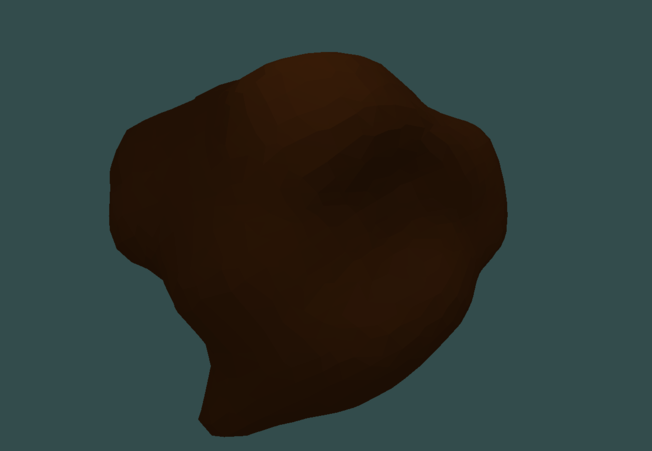
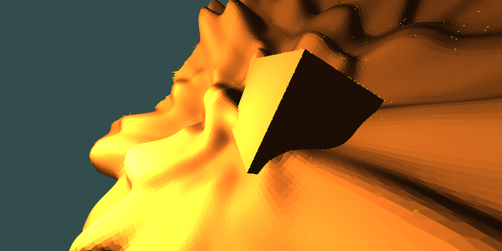
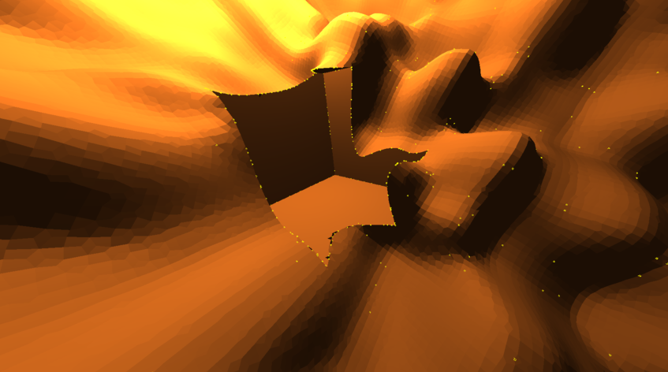
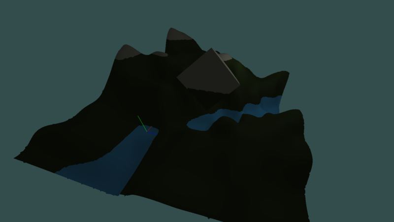

# voxelized3d
experimental 3D voxel engine

***REQUIRES NVIDIA VIDEO CARD(will be optional)***

________________________________________________________________________
#### INSTALLATION (LINUX + NVIDIA video card)

1)minimum OpenGL version 3.3 is required + libGL.so should be available in your PATH

2)install GLFW3

&nbsp;&nbsp;&nbsp;&nbsp;&nbsp;&nbsp;on ubuntu/debian it should be as simple as:

&nbsp;&nbsp;&nbsp;&nbsp;&nbsp;&nbsp;`sudo apt-get install libglfw3-dev`

&nbsp;&nbsp;&nbsp;&nbsp;&nbsp;&nbsp;or compile glfw3 from sources

3)CUDA is required (probably will be optional later), PATH also must be properly set

4)lapacke:

&nbsp;&nbsp;&nbsp;&nbsp;&nbsp;&nbsp;on ubuntu/debian:

&nbsp;&nbsp;&nbsp;&nbsp;&nbsp;&nbsp;`sudo apt-get install liblapacke-dev`

&nbsp;&nbsp;&nbsp;&nbsp;&nbsp;&nbsp;or compile from sources

5)install cmake(probably with GUI for simplicity)

&nbsp;&nbsp;&nbsp;&nbsp;&nbsp;&nbsp;on ubuntu/debian:

&nbsp;&nbsp;&nbsp;&nbsp;&nbsp;&nbsp;`sudo apt-get install cmake-gui`

6)compile cmake project in `bindings` directory of this project. After that copy outputted `libvoxelizedBindings.so` to the root of the project

7)install LDC https://dlang.org/download.html, DUB tool should be in your path after installation

8)run `export LD_LIBRARY_PATH=. && dub run --build=release`

________________________________________________________________________

#### INSTALLATION (Windows + NVIDIA video card)
Not yet tested
________________________________________________________________________

#### Screenshots

sampled on GPU(CUDA), extracted on CPU
